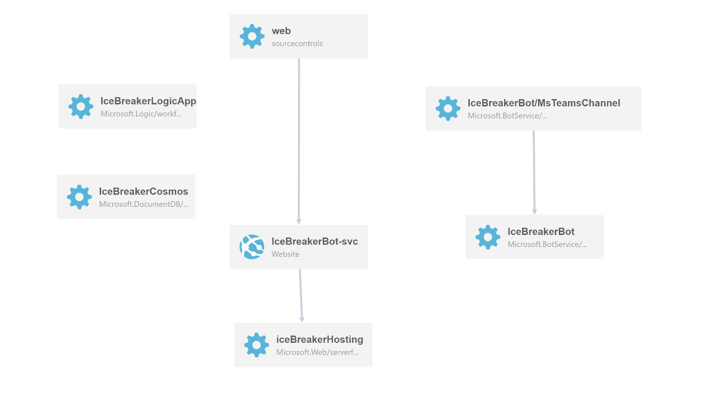

# IceBreaker Bot Architecture Overview
The following document will outline the overall architecture of the IceBreaker Bot app template. This will outline the following:
1. The types of Azure resources that are being provisioned
2. Possible data exchange between the resources

# Architecture Diagram

# Azure Resources Provisioned
The following resources will be provisioned by the ARM Template, and there will be further comments and descriptions made. The deployment template provisions: 
1. Microsoft Teams Bot and Microsoft Teams Channel registration
2. Service Hosting Plan - this will be acting as the hosting for the Bot App Service
3. Bot App Service - this is the web app which acts as the Bot Messaging Endpoint (`api/messages`)  
  * The Bot App Service has 2 dependencies - the first being the service hosting plan and the second being the source control 
4. Cosmos DB Account - this represents the database required for the IceBreaker Bot. In the Cosmos DB Account, the following are entailed:
   * Database named MeetupBotConfig
   * 1 collection titled - TeamsInstalled which will keep track of the teams that the IceBreaker Bot has been installed to
   * 1 collection titled - UsersOptInStatus which will keep track of the users that have actively *opted in* or *opted out* of future pairups
5. Azure Logic App - the Azure Logic App allows for automation of tasks. In the case of the IceBreaker Bot, the Azure Logic App is used for the automation of the pairing up action

# Database schema
The IceBreaker Bot template utilizes [Azure CosmosDB](https://azure.microsoft.com/en-us/services/cosmos-db/) to capture data related to the Teams in which this bot has been installed to, as well as various data related to the users. 