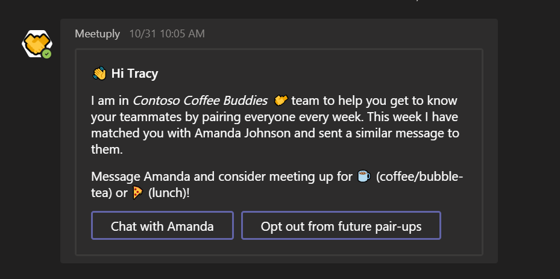

# Meetuply 🤝🤖
Meetuply is an open-source bot for Microsoft Teams that helps the whole team get closer by pairing members up every week at random, to meet for coffee, burgers, pizza, or a walk around the block.

The source for the bot is available under [MIT license](LICENSE) and demonstrates how to accomplish the following common scenarios in your bot:

* How to keep track of which teams your bot has been added to?
* How to retrieve the list of members in a team?
* How to send a message from your bot to a user in a one-on-one chat?
* How to monitor a team for new member additions and welcome each new member personally?
* How to send [Adaptive Cards](https://docs.microsoft.com/en-us/adaptive-cards/getting-started/bots) from your bot?
* How to retrieve information about a team?

# Setting up ⚙

## Setting up the bot
* Fork this repo.
* Open MeetupBot.sln file in Visual Studio.
* Open Web.config file and update it as follows:
  * Use your web-browser to register [a new bot for Teams](https://dev.botframework.com/bots/new).  
  * Replace `ADD_BOT_APP_ID_HERE` with the Application ID you received while registering your bot.
  * Copy the Application Secret, and replace `ADD_BOT_APP_SECRET_HERE` in Web.config with this value.
* Use the following PowerShell command to create a new Guid: `[guid]::NewGuid()`.
  * Copy this Guid value and paste it into your Web.config for `CHOOSE_A_KEY_HERE`.
  
## Setting up CosmosDB used by the bot to track which teams it has been added to, and which users have opted out
* Go to [Azure Portal](https://portal.azure.com) and register a new Azure Cosmos DB database.
* Choose "Core (SQL)" for API.
* Create a database with name `MeetupBotConfig`
* Create the following collections:
  * `TeamsInstalled` with partition-key as teamId.
  * `UsersOptInStatus` with partition-key as tenantId.
* Copy the Cosmos DB endpoint URL and paste it into Web.config to replace `ADD_COSMOS_DB_ENDPOINT_URL_HERE`.
* Copy the Cosmos DB key value and paste it into Web.config to replace `ADD_COSMOS_DB_KEY_HERE`.

## Publish your bot to Azure
Publish your bot to Azure from Visual Studio and paste the URL of the newly created service in the `Messaging endpoint` field in the [Bot Framework Portal](https://dev.botframework.com) configuration for yout bot. Just suffix it with /api/messages.

## Setup the Scheduler job to periodically pair up people
* Set it up to run every Monday at 10am and make a HTTP GET against `https://<your_bot>.azurewebsites.net/api/processnow/<key>`.
* Replace `<key>` with the Guid you created above and pasted for `CHOOSE_A_KEY_HERE`.

## Update the manifest and sideload!
* Download the [Teams app manifest file for Meetuply](manifest/Meetuply.zip) from this repo.
* Unzip and open manifest.json file. Replace `ADD_BOT_APP_ID_HERE` with the Application ID you received during setting up your bot.
* Select all files in the current folder of the manifest (there're 3 of them in there), and Compress again.

# Questions ❓ / Issues 🙋‍♂️ / Feedback 🗨
Post [here](https://github.com/siduppal/TeamsMeetuplyBot/issues).

Contributions are welcome! 👏

# Deploy to Azure
