# IceBreaker Bot

IceBreaker Bot is an open-source bot for Microsoft Teams that helps the whole team get closer by pairing members randomly to meet for coffee, burgers, pizza, or a walk around the block. The code for the bot can be easily deployed in one of two methods: PowerShell or the Deploy to Azure button. Regardless of the method that you choose, you need to have an active GitHub account. Both of the approaches below will also allow you to customize the name, and branding of the IceBreaker Bot. 

## How to deploy the IceBreaker Bot to Azure through PowerShell

The set of instructions below already assume that you are running a Windows 10 PC that has PowerShell version 5.1 installed. 

1. Fork the OfficeDev repository into your GitHub account
2. Clone the newly forked repository to a location on your Windows PC
3. To run the script `Source\v3Net\DeploymentAutomation\IceBreakerBot-Deployment.ps1`, you would have to run Windows PowerShell as an Administrator. Navigate to the start menu on your screen and search for Windows PowerShell. You should see something similar to the below:
   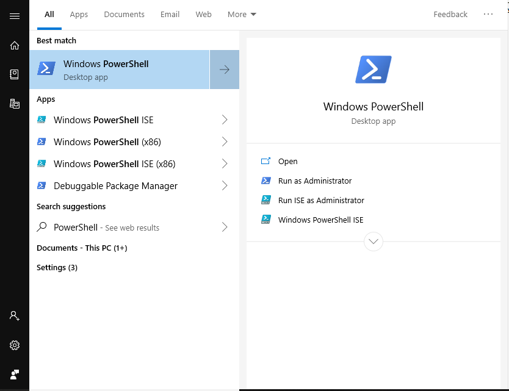
4. From the screenshot above, you want to select the option that reads Run as Administrator and you should see a Windows prompt asking for you to give consent. Clicking on yes would result in the following screenshot:
   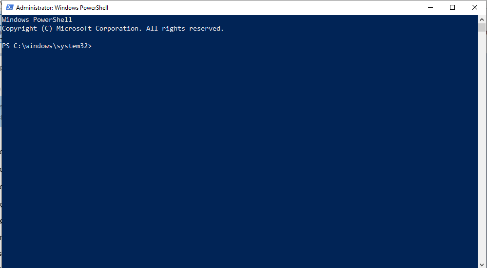
5. The following command in PowerShell, `cd` represents change directory - It is important to run this command to navigate to the directory where the deployment script resides. Following `cd` you should make sure to provide the full path to the deployment script, and your screen should resemble something similar to the below:
   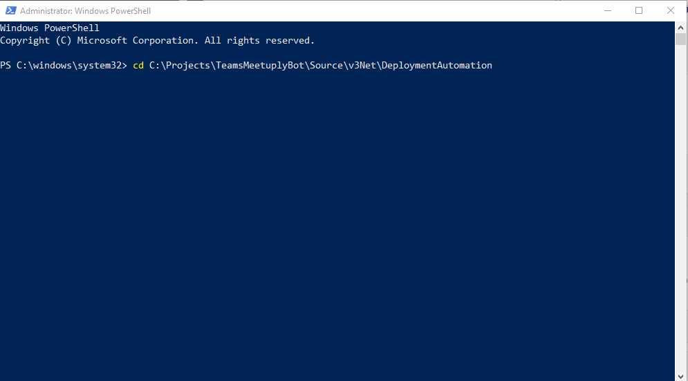
  - As a note from the above screenshot - there is already a `C:\Projects` directory already created and the repository was cloned to that location. 
6. Hit the enter key after entering the command in the screenshot in Step 5. You would know that you have successfully navigated to the directory when the PowerShell window shows the directory you wish to navigate to - your PowerShell window would look something like below:
   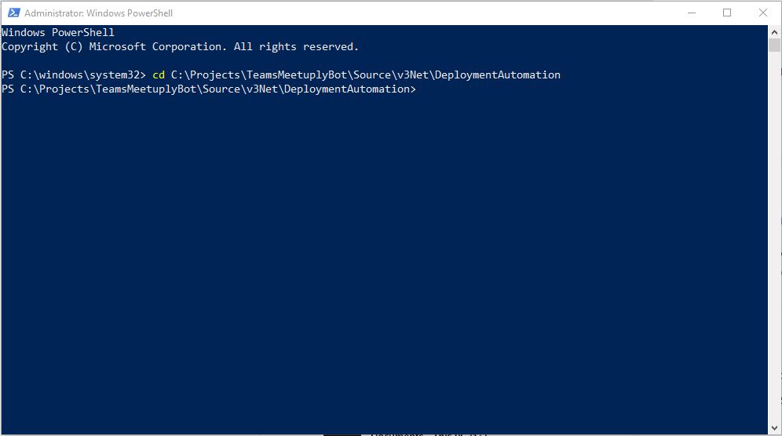
7. With PowerShell, anytime a PowerShell script is to be executed (file extension is `.ps1`), you want to prepend the following characters: `.\` to the file. At the end you want to type the following: `.\IceBreakerBot-Deployment.ps1` and you want to make sure that your screen looks like below: 
   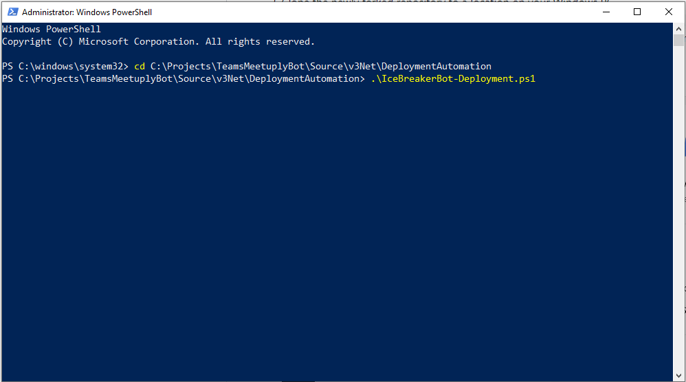
8. On your keyboard, hit the Enter key. The PowerShell script will now do two key things: 
   a. Allow for the deployment script to run
   b. Install necessary modules to automate the deployment of the bot code to Azure. 
You should now see a popup window that will prompt you to provide your Azure credentials:
   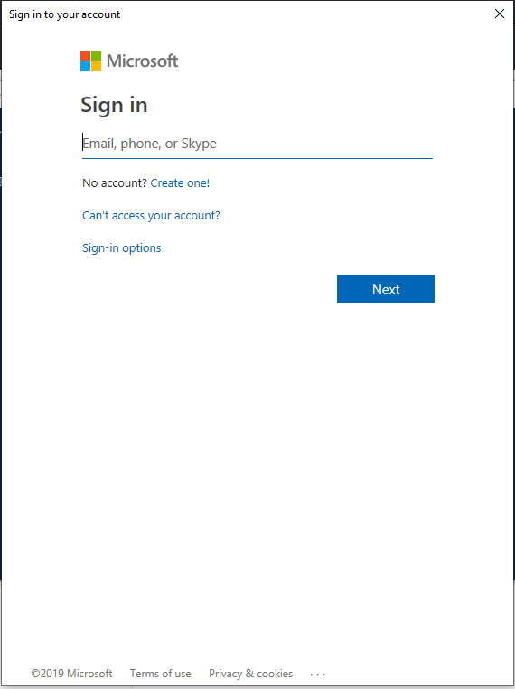
9. Follow the processes to log on to your Azure AD account. Once you have successfully logged in, the authentication popup will go away and you will see Windows PowerShell. You will now be prompted to provide some information starting with the name of your new app. Even though this template is called IceBreaker Bot, you as the administrator have the flexibility to change the name to whatever name is appropriate. 
    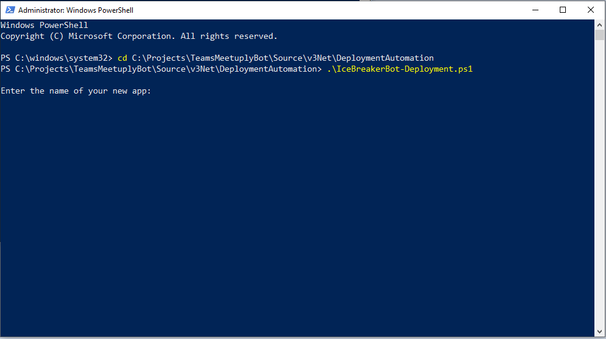
10. From the screenshot above, for purposes of the setup guide, the new Azure App is named PowerShell IceBreaker - this is the name of the app and this name is the same that is going to be shown in Microsoft Teams. Next, you will be prompted to give a description of the app. Again, for the purposes of the setup guide, the description is written as `Demonstrating the setup of the bot through PowerShell`. As an administrator, you may set the description to whatever is appropriate. 
    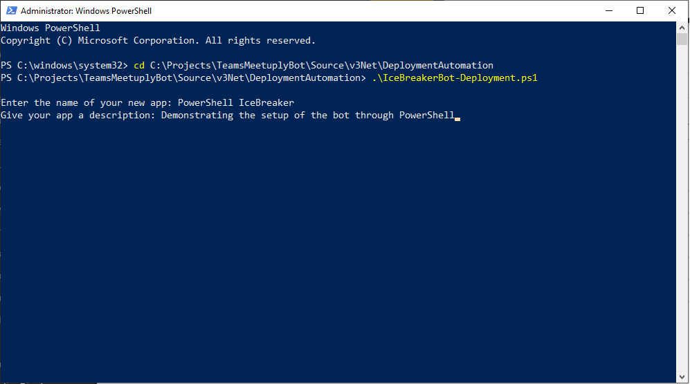
11. After providing the name and the description, you want to provide an icon for the bot to be deployed. Keep in mind the following details:  
    a. The bot icon must be an image that is publicly available - it is recommended that you do not provide an intranet links (URLs that resolve to images within your organization)  
    b. The icon itself must resolve to a .PNG file - the reason for this is that you need a .PNG file for the manifest which is to be sideloaded into your tenant.  If you have been able to follow the setup guide, so far, your screen should resemble something similar to the below: 
    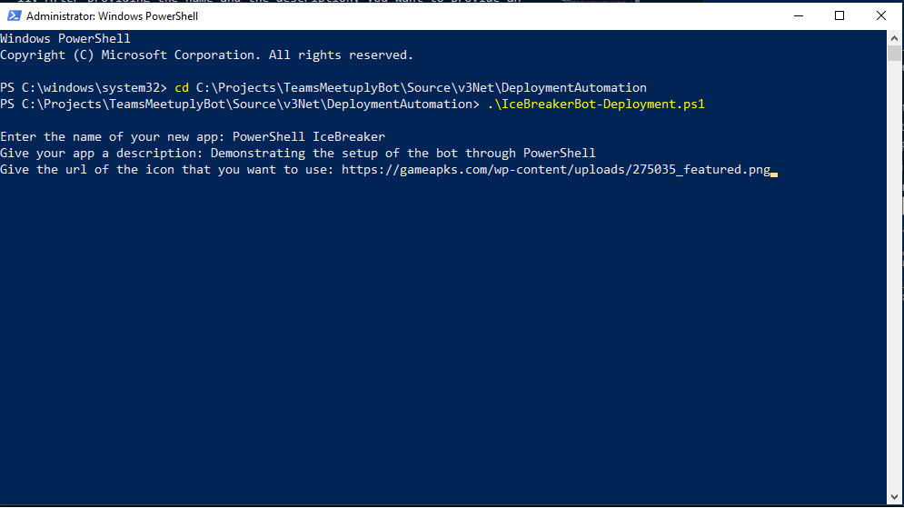
12. Next, the Azure PowerShell CLI will then request for you to provide the GitHub URL for the code of the bot. Now we will get into the deployment of the bot. When forking any repository, you get an exact copy of the original repository in your GitHub account. With this, developers can make any changes that are relevant to your organization. Please look at the following screenshots:
    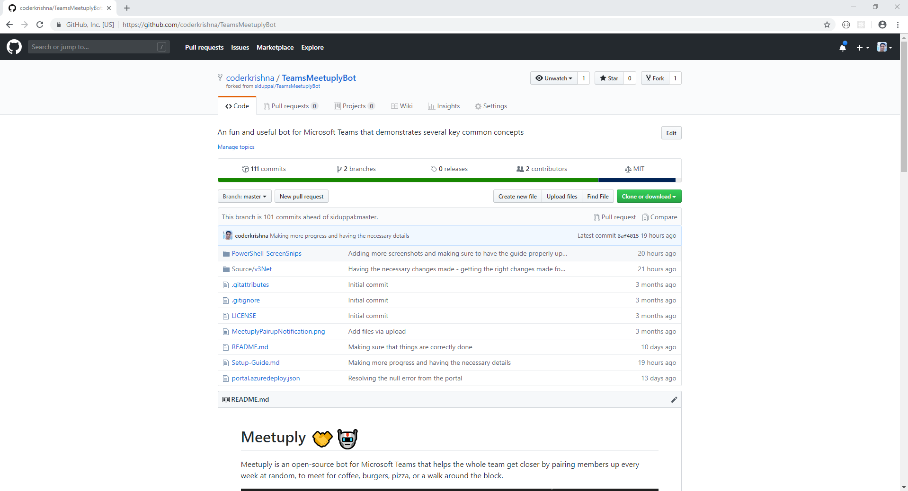
- The above screenshot resembles what would happen when you fork the Microsoft repository to your account. The screenshot below would be the result when you copy and paste the URL from the above screenshot: 
    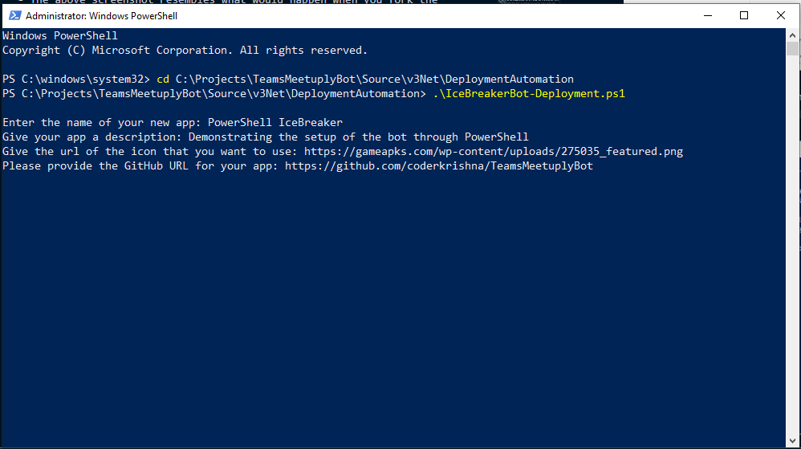
13. Azure PowerShell CLI will ask you to provide the name of the exact branch. In this step, the recommended value to provide is `master`. However, if you have made changes which pertain to your organization, it is recommended that you create a branch of the cloned repository that you forked. For the purposes of this setup guide, the value provided will remain as `master`.
    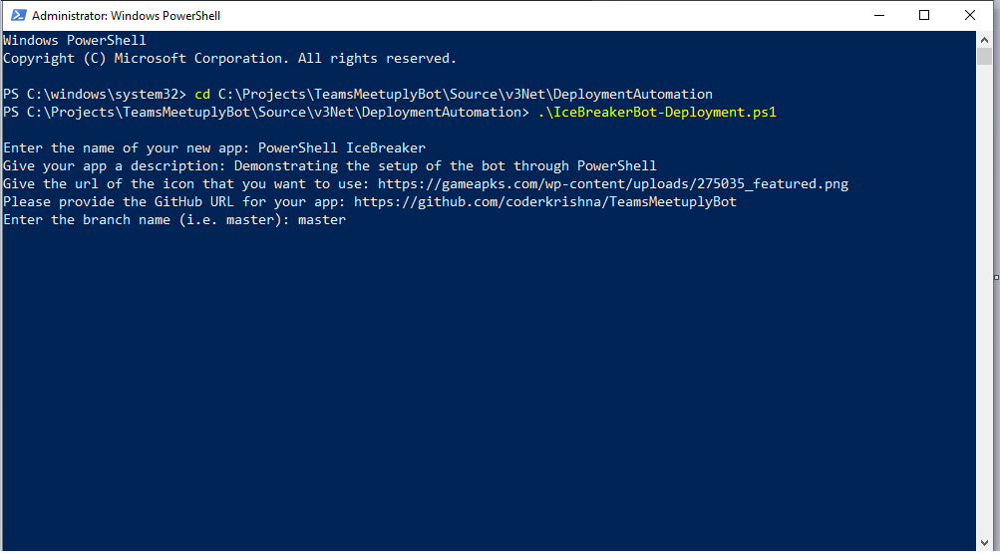
14. The Azure PowerShell CLI will then ask for an email to provide feedback. The reason is that the bot will alert users that if there is any feedback that could be provided. 
    
15. Our `PowerShell IceBreaker` app pairs up members of a team at a random interval - which you as the administrator can set. The Azure PowerShell CLI will prompt for one of two options - Week or Month. It is recommended that you provide *Week* instead of *Month* because this weekly frequency would elicit a greater sense of comraderie among the team members. 
    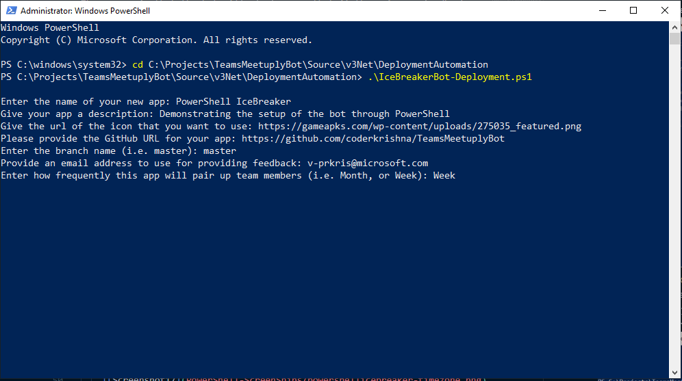
16. The `PowerShell IceBreaker` app also needs an interval by which the pair ups will happen. From the previous step, it was recommended that you as the administrator configure the pair ups to happen on a weekly basis. With that in mind, it is recommended that the interval value be `1`. The interval value can be changed as well, however, by keeping the interval value at `1` the team members will be paired up more often. 
    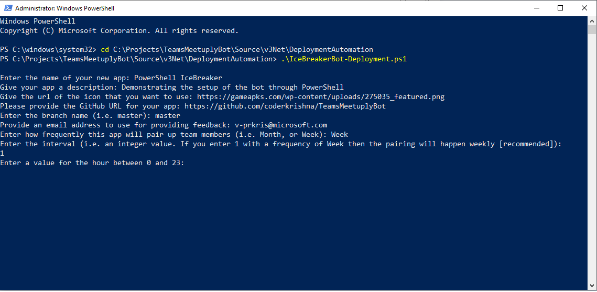
17. The random pair ups not only happen on a weekly basis, but as the tenant admin you can specify the time, and the day of the week. Azure PowerShell CLI will ask for those values, and the screenshot below will show all of the values (i.e. hour, min, and day of the week) being populated. 
    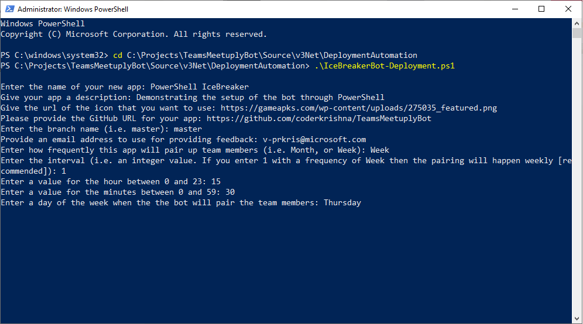
18. `PowerShell IceBreaker` configuration is nearly completed. Now, a major advantage in this configuration experience is that you, as the administrator can specify the exact time zone. For example, if you are an administrator based in the Seattle area, you would write `Pacific Standard Time`. If you are an administrator located in the Indian subcontinent, you write `Indian Standard Time`. Again, for the purposes of this guide, the administrator is located in the Seattle area - so the time zone is `Pacific Standard Time`.  
    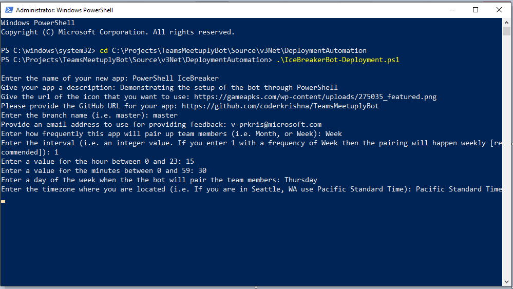
19. The previous 18 steps are all about the configuration of our `PowerShell IceBreaker` bot/application. Now we begin the deployment. Once all of the information is entered in the previous steps, the PowerShell CLI will automatically generate a file called `deploymentParameters.json` file which will be necessary for the deployment of our application. We need a resource group which must suffice the following [criteria](https://docs.microsoft.com/en-us/azure/portal-docs/playbooks/azure-readiness/organize-resources?tabs=NamingStandards). As an administrator, you can create a new resource group or use previously existing resource groups. For this setup guide, we will be using the new resource group `rgMeetuply-2019`. 
    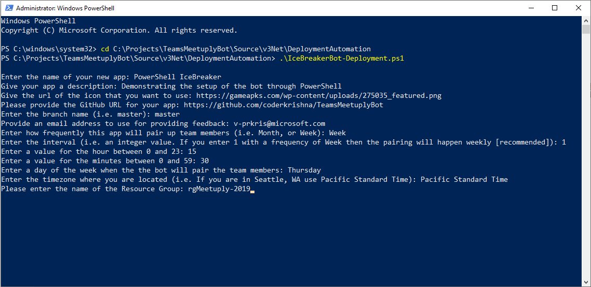
20. Before the deployment actually happens we need to provide the location of the resource group `rgMeetuply-2019`. Since an administrator deploying this is located in the Seattle, WA area, the location will be `westus`. 
    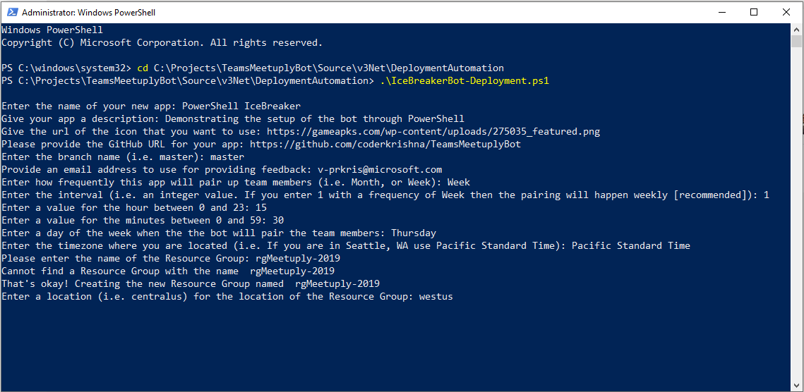
21. Finally we need to give this deployment a name. Make sure to not use special characters (i.e. `.`,`-`,`!`, etc..). Keep the name to be strictly alphanumeric characters. For the purposes of the setup guide we will have the deployment name be `PowerShellDemo`. Once the enter key has been pressed two things will happen:  
    1. There will be a new resource group provisioned - named `rgMeetuply-2019`
    2. There will be a deployment named `PowerShellDemo` and you can be able to track that progress.  
    
22.   The deployment will take some time, however you can track the deployment progress on the portal: 
    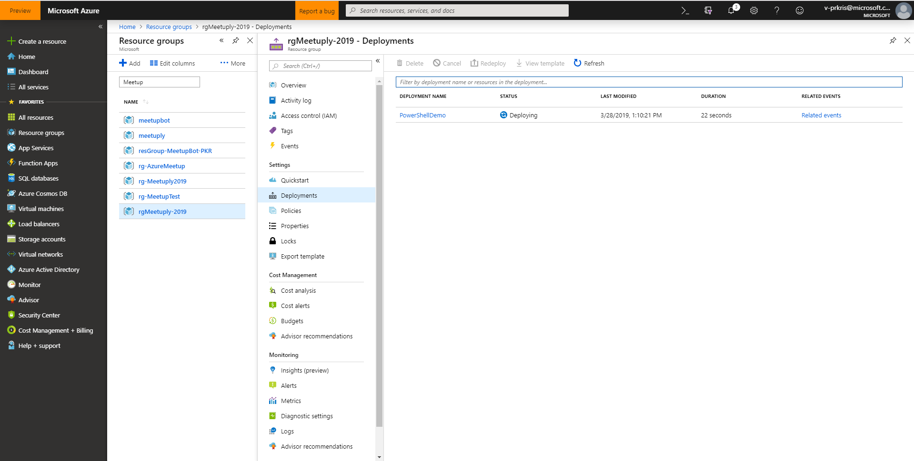
23. After a few minutes, and if the deployment succeeds, your PowerShell window will look like this: 
    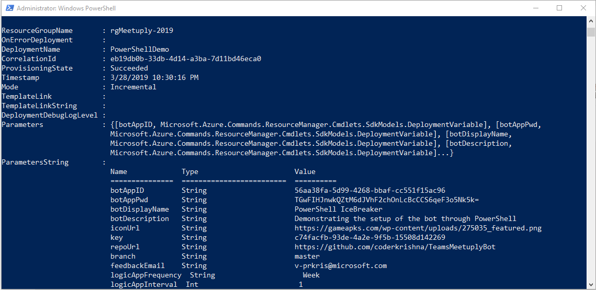
There will be a few key pieces of information that we will need in order to prepare for our `PowerShell IceBreaker` bot to be sideloaded into Microsoft Teams. 

**NOTE** Please *do not* close the PowerShell window as it will contain important information that is required for sideloading our newly deployed app into Microsoft Teams.

### Preparing to sideload
The following instructions are going to help you, the administrator prepare our newly deployed application to be sideloaded into your tenant.

1. In the same location that you previous cloned the official repo, navigate to the compressed zip folder located in the `TeamsMeetuplyBot\Source\v3Net\manifest` directory. You should see something similar to the screenshot below:
   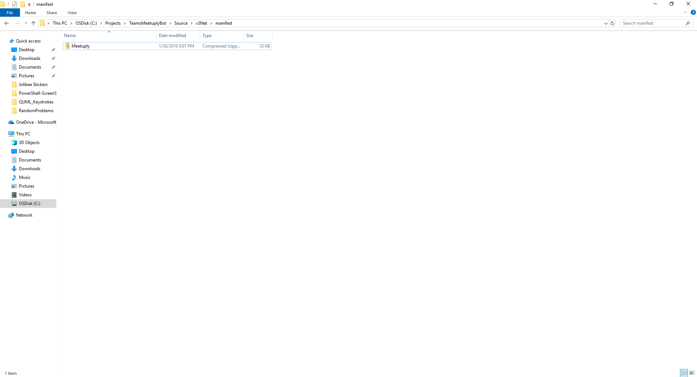
2. Select the compressed folder, right-click on the compressed zip file and select "Copy"
   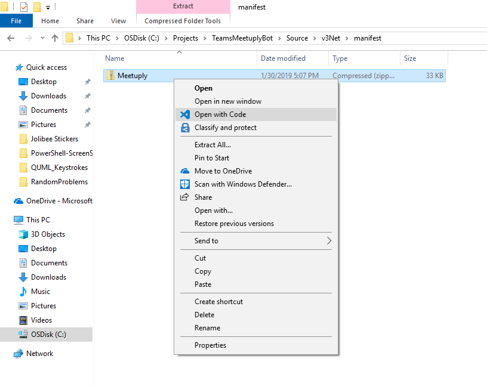
3. Navigate to another directory (Preferably on your `C:\` drive, and create a new folder called `Manifests`) - to quickly do this, press the following keys: `Ctrl, Shift + N` (on Windows)
   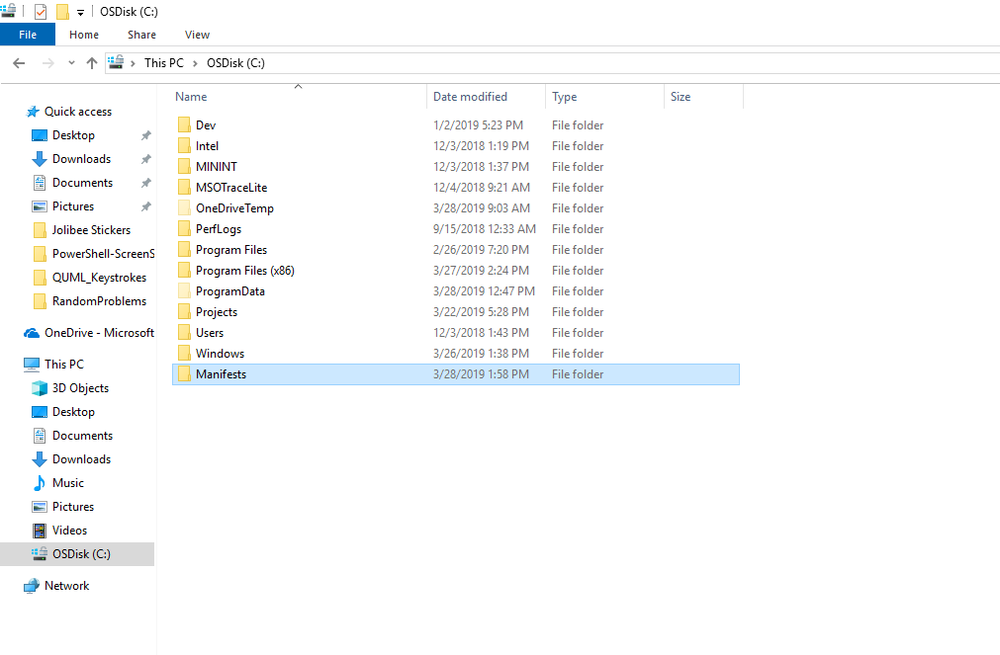
4. Once you navigate inside of the `Manifests` folder on your `C:\` drive, paste the copied compressed folder, using `Ctrl + V` (again on the Windows PC). 
   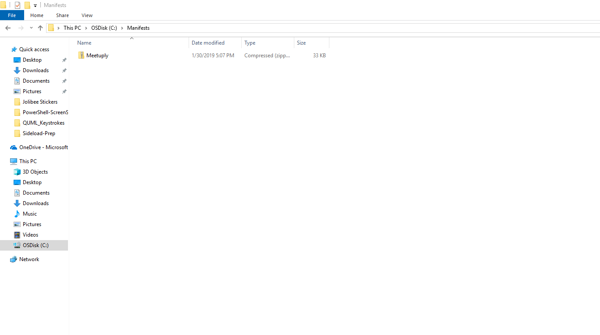
5. The next thing you would want to do is in fact extract all of the contents so that we can modify the manifest.json file. To do this, right click on the compressed folder and select "Extract All"
   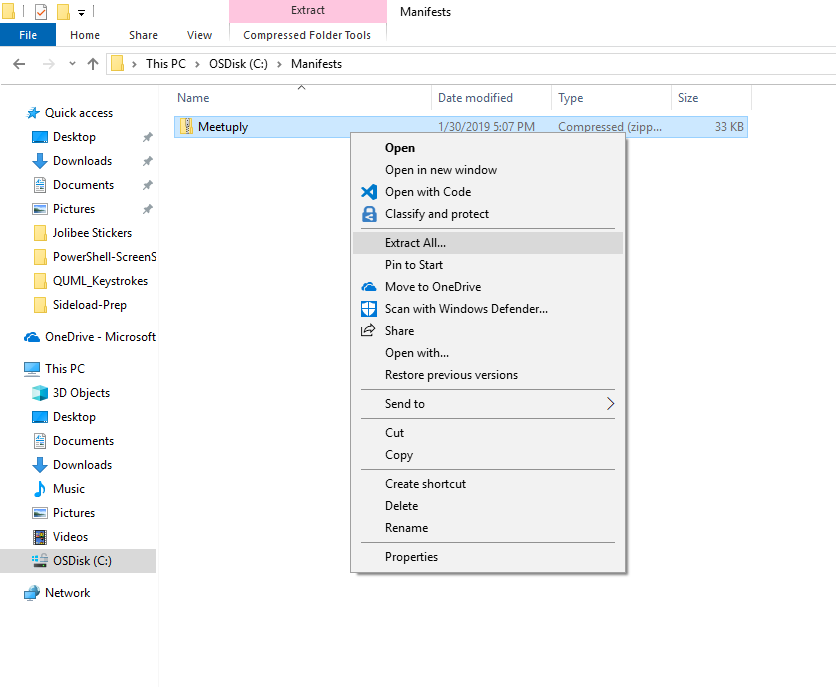  
There will then be a prompt and a directory of the extracted contents will be shown, click on the button that reads "Extract". 
   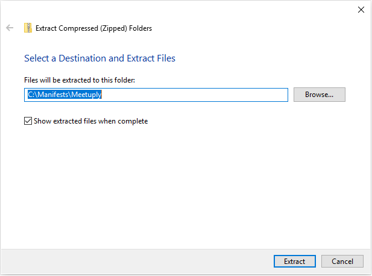  
Once the "Extract" button has been clicked the results of the extraction will display in the screenshot below: 
   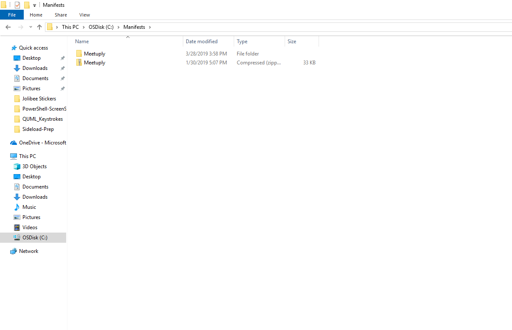
6. Navigate into the extracted directory and you should see three files. 1 color.png file, 1 manifest.json file, and 1 outline.png file.  
   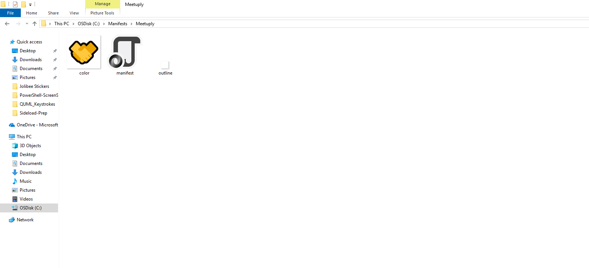
7. Now it is time to change the default manifest, and also change various icons so that we are able to get our `PowerShell IceBreaker` application in Teams! To do this, we need to edit the `manifest.json` file
   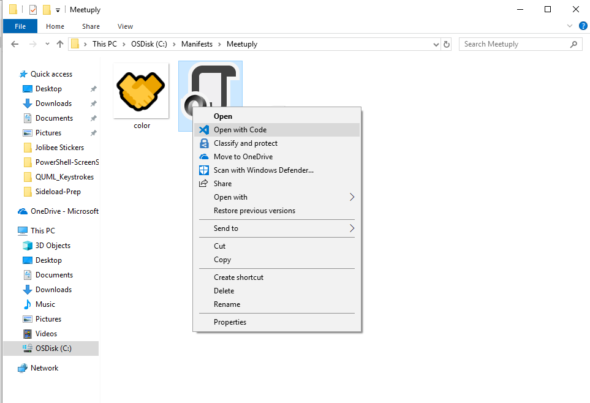
- Note: Visual Studio Code is a free code editor that is publicly available and you can download the editor [here](https://code.visualstudio.com/)
8. If you have Visual Studio Code (more succinctly known as VS Code), then the program will open and allow you to edit the `manifest.json` file. Your screen should resemble something similar to the below: 
   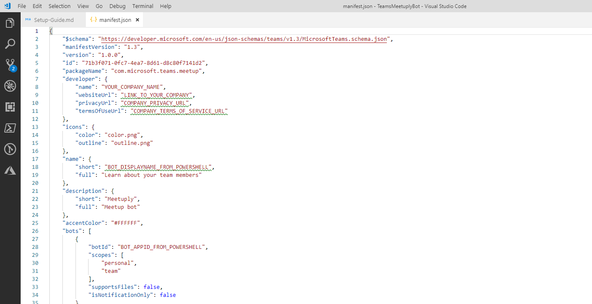  
- We need to change the following properties in the manifest.json file: botId; name; and description. 
9. From the screenshot above in Step 8, and making sure that the PowerShell window is still not closed, you have to copy and paste a few values.  
    a. Copy the value for the `outputBotAppId` from the PowerShell window and replace that with the `BOT_APPID_FROM_POWERSHELL` in the screenshot in Step 8.  
    b. Repeat the same procedure for the `BOT_DISPLAYNAME_FROM_POWERSHELL`  
    c. Ensure that for the `name, websiteUrl, privacyUrl,` and `termsOfUserUrl` are links that point to your company/tenant. 
10. From the PowerShell window, make sure to navigate to the iconUrl and download the image, and save the image as `color.png` in the extracted folder in Step 6. 
11. Once you have replaced the `color.png` file in the previous step and made the necessary changes to the `manifest.json` file, it is now time to create the package to sideload. 
12. In the extracted folder, make sure to now select the items in the following order: `color.png`, `outline.png`, and finally `manifest.json`
13. Right click and select the option which reads "Send to" and then select the option that reads "Compressed (zipped) folder"
14. A zipped folder will be created automatically and it would be named `manifest.zip`
15. Rename the `manifest.zip` folder to `YOUR_APP_NAME.zip` where YOUR_APP_NAME is the name of your IceBreaker Bot (i.e. PowerShell IceBreaker)
16. Finally upload this app into Teams and you can configure which Team that this is app is to be installed for

## How to deploy the IceBreaker Bot to Azure using the Deploy to Azure button
In order to be able to effectively deploy the bot to Azure, you will need to keep track of a few key pieces of information. These details are:
1. The GitHub repository URL - when you provision the bot in Azure via the Deploy to Azure button, the web user interface will ask for the GitHub repository URL. 
2. Microsoft App Id and App Secret - these details you can obtain through the [App Registration Portal](https://apps.dev.microsoft.com)

To deploy the IceBreaker Bot to Azure, follow the steps written below:  
1. Navigate to the [App Registration Portal](https://apps.dev.microsoft.com) and make sure to log in with your credentials. 
   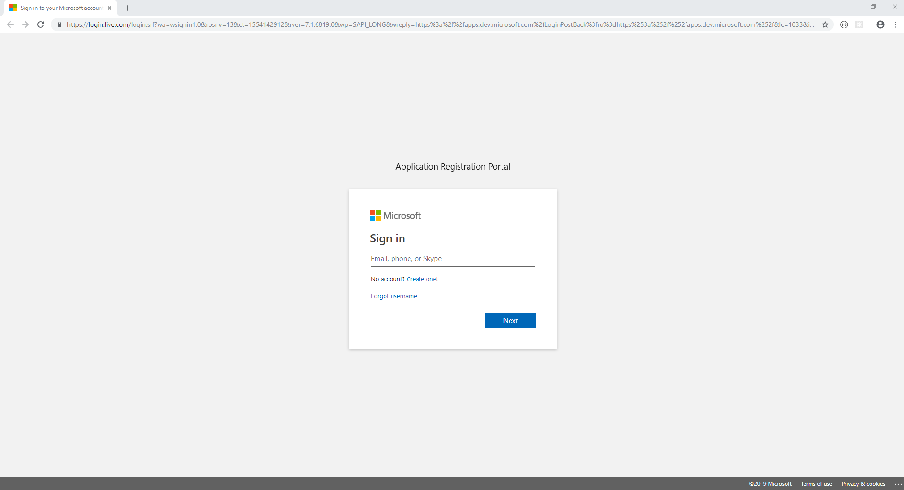
2. Once you have logged in, you should be able to see a portal that would either have applications listed, or it would be an empty page. 
   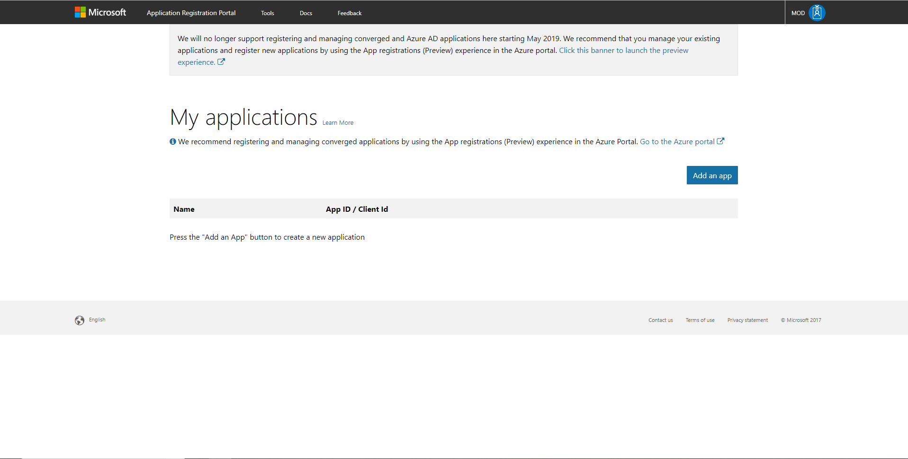
3. Next, you would want to click on the button that reads `Add an app` to create a new registration
4. Once you click on that, you should see a popup asking for the name of the new app. For this guide, you can have the name as `IceBreaker Bot`, however you have the freedom to choose whatever app name is appropriate for your organization. 
   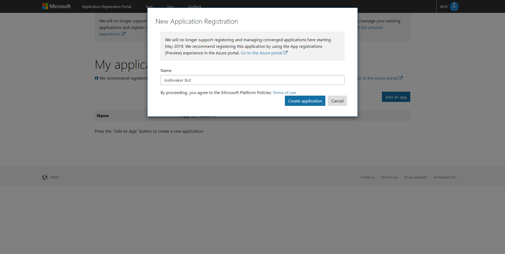
5. Once your new application has been created, a brand new Application Id would be generated. 
   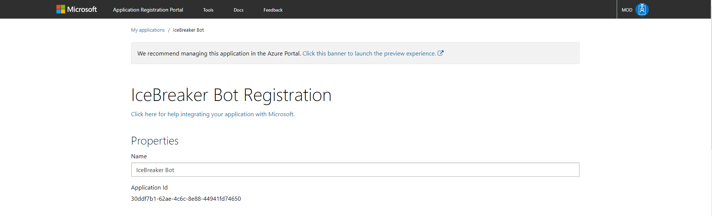
6. Make sure you copy and paste that Application Id to a notepad document. You will need this Application Id. 
7. Below the Application Id GUID string, there is a button that will generate the Application Secret. The Application Secret and Application Id are key pieces of information. Once the Application Secret is generated, copy the Application Secret to the same Notepad that contains the Application Id. 
   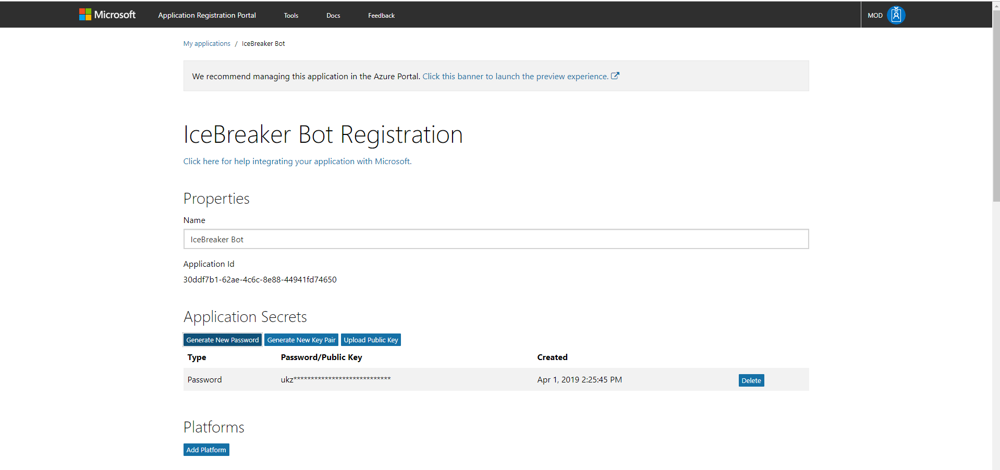
8. Next you have to generate a Key which is a random GUID. To do this, you have to open PowerShell in Administrator Mode. 
9. Once PowerShell is opened in Administrator Mode - you have to write the following syntax: `[guid]::NewGuid()`
    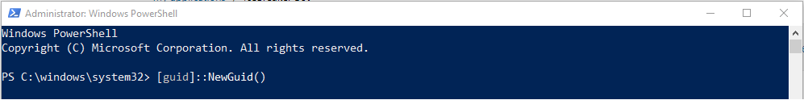
10. After the GUID has been generated you have to paste the GUID into the same Notepad file that contains the Application Id and the Application Secret. 
11. Once you have those key pieces of information, navigate to the GitHub repository where you forked the original Microsoft repository. Copy and paste that link into the Notepad file that contains the other information. 
12. In the cloned repository there is a button that would read `Deploy to Azure`. By clicking on the button, you would be taken to the Azure Portal. 
    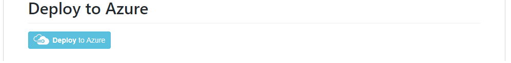
13. On the Azure Portal, you would be shown a form that would prompt you for various pieces of information. The screenshot below would show the necessary information that is required:
    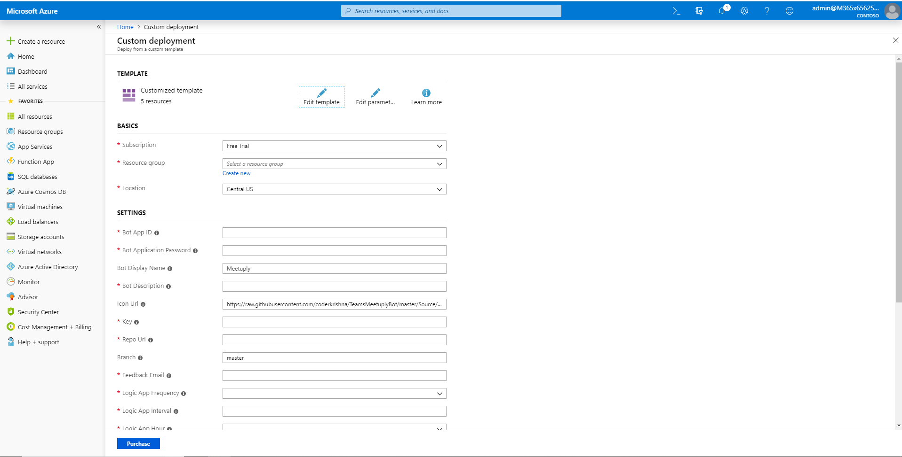
14. From the screenshot above, you as tenant admin can be able to customize various different aspects of the IceBreaker Bot.
15. Ensure to provide the Azure Subscription, the Resource group, and the location first. 
- If you already have a resource group, you can use the existing resource group provided if the resource group contains no resources
- You can also create a new resource group as well
16. Proceed to fill the form providing details for the following: 
    * **Bot App ID** - Application ID from Step 1
    * **Bot Application Password** - Application Password from Step 7
    * **Bot Display Name** - You can change the display name here (or you can leave it to the default value)
    * **Bot Description** - It is recommended that a description of the bot is provided (i.e. describe what the bot would do)
    * **Icon Url** - The location of the bot icon
    * **Key** - The randomly generated GUID from Step 9
    * **Repo Url** - The link to the code repository hosted on GitHub (this must be a public url)
    * **Branch** - If there are custom changes that you have made, you would list that branch here. Otherwise, the value of `master` will be used
    * **Feedback Email** - Providing an email address of a contact person
    * **Logic App Frequency** - The frequency at which the pair ups will happen for the IceBreaker Bot
    * **Logic App Interval** - Setting the interval, which is an integer value. Thus, a value of 1 with the frequency of week results in the random pairups happening weekly
    * **Logic App Hour** - This is setting up a time for which the random pairups are to happen. The value can be between 0 and 23
    * **Logic App Mins** - Exact minute at which the pairups are to happen, and the value goes between 0 and 59. 
    * **Logic App DOW** - The DOW represents the **D**ay **O**f the **W**eek. You can configure on which the random pairups take place. 
    * **Logic App Timezone** - As the tenant admin, you can be able to specify the time zone. If you are based in the Seattle, WA area, you would provide the value of `Pacific Standard Time`
17. Once the information for the above inputs has been provided, you scroll to the bottom of the page and click on the check box next to the privacy statement. 
18. Scroll further to the bottom of the page and click on the button that reads `Purchase`. 
19. Doing so would kick off a deployment to the resource group that you specified in Step 13