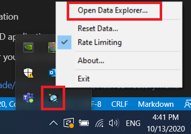
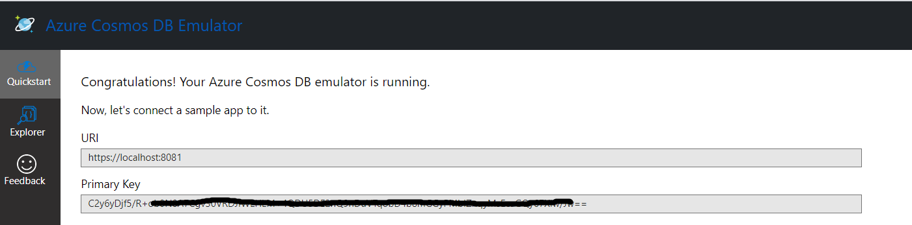
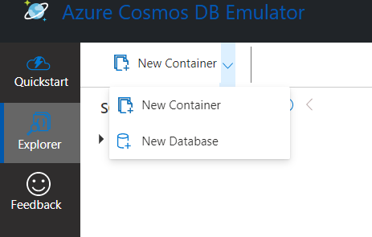
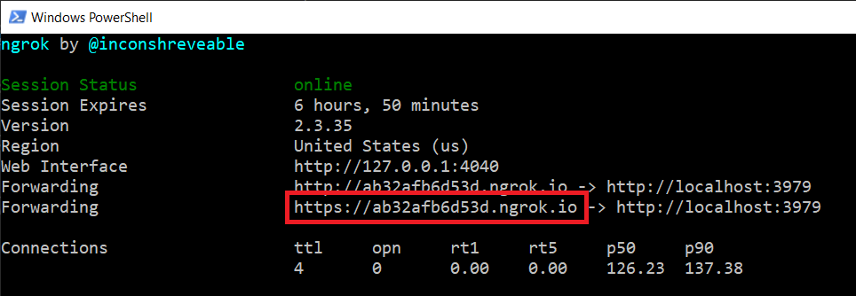
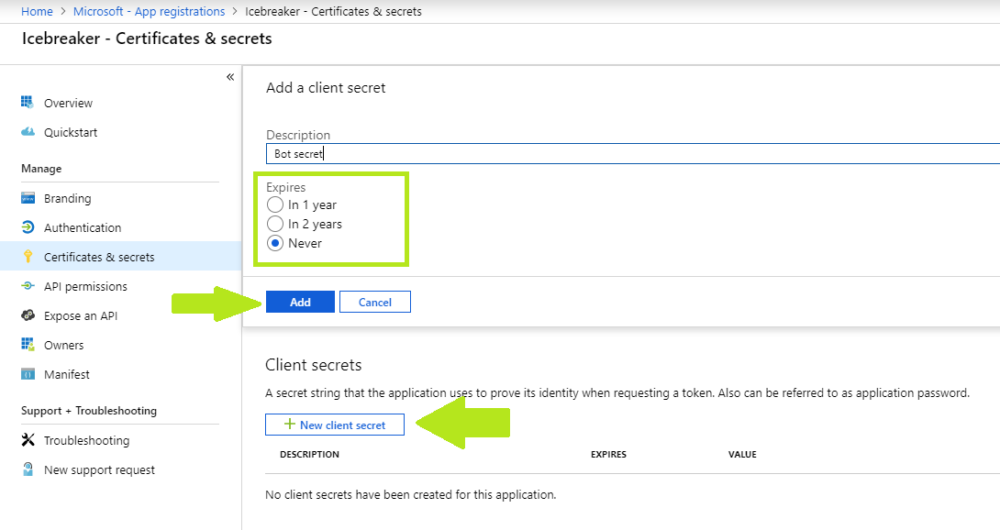
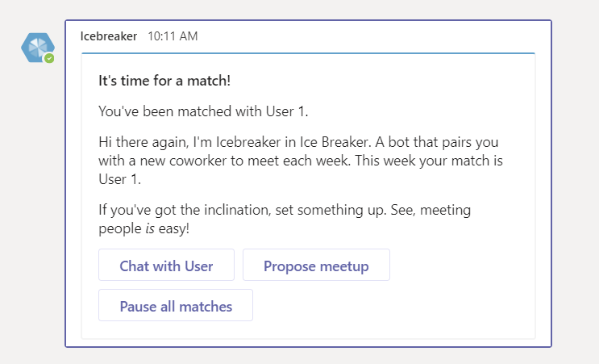

# Teams Ice Breaker

Bot Framework Teams Ice Breaker.

This bot has been created using [Bot Framework](https://dev.botframework.com). 

## Prerequisites

- Microsoft Teams is installed and you have an account
- [.NET Framework](https://dotnet.microsoft.com/download/dotnet-framework) version 4.7
- [ngrok](https://ngrok.com/) or equivalent tunneling solution
- [Azure Cosmos Emulator](https://aka.ms/cosmosdb-emulator) for local development with Cosmos DB
- Visual Studio (2017 or higher)

## To try this sample

> Note these instructions are for running the sample on your local machine, the tunneling solution is required because the Teams service needs to call into the bot.

1) Create Cosmos DB locally through the emulator
    1. Open Azure Cosmos DB emulator
    2. From the system tray icon 
    3. This should open this URL in the browser (https://localhost:8081/_explorer/index.html)
    4. Write down URL, Primary Key values as we will paste them in source code configuration 
    5. Click on Explorer left menu, wait until emulator initialize and activate the page
    6. Click on new database 
    7. Fill in the database id field with "icebreaker-storage" name. 

1) Clone the repository

    ```bash
    git clone https://github.com/OfficeDev/microsoft-teams-icebreaker-app.git
    ```

1) If you are using Visual Studio
   - Launch Visual Studio
   - File -> Open -> Project/Solution
   - Navigate to `Source` folder
   - Select `Icebreaker.sln` file

1) Run ngrok - point to port 3979

    ```bash
    ngrok http -host-header=rewrite 3979
    ```
    Write down the https URL to be used later.
    

1) Register Microsoft Azure AD application

    Register one **multi-tenant** Azure AD application with one Secret.

    1. Log in to the Azure Portal for your subscription and go to the “App registrations” blade at https://portal.azure.com/#blade/Microsoft_AAD_IAM/ActiveDirectoryMenuBlade/RegisteredAppsPreview.

    1. Click on "New registration" and create an Azure AD application.
        1. **Name**: The name of your Teams app - if you are following the template for a default deployment, we recommend "Icebreaker".
        1. **Supported account types**: Select "Accounts in any organizational directory"
        1. Leave the "Redirect URI" field blank.

        

    1. Click on the "Register" button.

    1. When the app is registered, you will be taken to the app's "Overview" page. Copy the **Application (client) ID**; we will need it later. Verify that the "Supported account types" is set to **Multiple organizations**.

        

    1. On the side rail in the Manage section, navigate to the "Certificates & secrets" section. In the Client secrets section, click on "+ New client secret". Add a description for the secret and select an expiry time. Click "Add".

        

    1. Once the client secret is created, copy its **Value**; we will need it later.

    At this point you have 2 unique values:
    * One application (client) ID
    * One client secret

1) Create [Bot Framework registration resource](https://docs.microsoft.com/en-us/azure/bot-service/bot-service-quickstart-registration) in Azure
    - Use the current `https` URL you were given by running ngrok. Append with the path `/api/messages` used by this sample
    - Ensure that you've [enabled the Teams Channel](https://docs.microsoft.com/en-us/azure/bot-service/channel-connect-teams?view=azure-bot-service-4.0)
    
1) Update the `web.config` configuration. Fill in the missing values:

    1) MicrosoftAppId: The Application (client) ID from the Azure AD application created above.
    1) MicrosoftAppPassword: The client secret from the Azure AD application created above.
    1) CosmosDBEndpointUrl: The "URI" from Azure Cosmos DB Emulator page.
    1) CosmosDBKey: The "Primary Key" from the Azure Cosmos DB Emulator page.
    1) CosmosDBDatabaseName: Same name you used when creating Cosmos DB in the emulator page. (Default is "icebreaker-storage").
    1) APPINSIGHTS_INSTRUMENTATIONKEY: This one can be filled if you created an app insights resource on the Azure portal for troubleshooting purposes. Or can be ignored locally.
    1) AppBaseDomain: This should be the ngrok url domain we copied earlier. If URL is https://ab********.ngrok.io, then base domain will be ab********.ngrok.io only.

1) __*This step is specific to Teams.*__
    - **Edit** the `manifest.json` contained in the  `Manifest` folder to replace your Microsoft App Id (that was created when you registered your bot earlier) with the place holder string `<bot id>` 
    - Replace `<app domain>` in manifest file with the same value used for AppBaseDomain in web.config above (ab********.ngrok.io)
    - Replace `<company name>`, `<website url>`, `<privacy url>`, and `<terms of use url>` fields with values of your choice.
    - **Zip** up the contents of the `Manifest` folder to create a `manifest.zip`
    - **Upload** the `manifest.zip` to Teams (in the Apps view click "Upload a custom app")

1) Run your bot, from Visual Studio with `F5`.

## Interacting with the bot in Teams

> Note: After installing the bot in a team. You can trigger the matching algorithm manually from the browser by going to `http://localhost:3979/api/processnow/19c6e180-0c37-4056-bbf7-11810f6f9305`.

> Once the match is done, the bot will send messages to matched pairs to plan their meeting.


## Further reading

- [How Microsoft Teams bots work](https://docs.microsoft.com/en-us/azure/bot-service/bot-builder-basics-teams?view=azure-bot-service-4.0&tabs=javascript)
