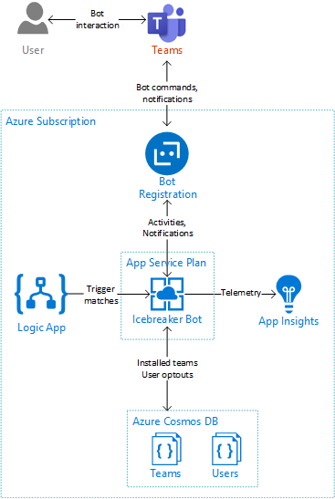

The **Icebreaker** application has two main components:
* **Teams Bot**: An Azure App Service web app that functions as the Teams Bot
* **Pairup Logic App**: An Azure Logic App configured to send a request to the bot to initiate the pairups at the appropriate time

## Teams Bot

The Teams Bot is built using the [Bot Framework SDK v3 for .Net](https://docs.microsoft.com/en-us/azure/bot-service/dotnet/bot-builder-dotnet-overview?view=azure-bot-service-3.0). Because it is set up as a [notification only bot](https://docs.microsoft.com/en-us/microsoftteams/platform/concepts/bots/bots-notification-only), the bot does not need to accept any text inputs. If it were to receive one, it is set up to simply return a card with a link to the tour. Instead, the bot listens for [conversationUpdate](https://docs.microsoft.com/en-us/microsoftteams/platform/concepts/bots/bots-notifications#team-member-or-bot-addition) events in order to welcome and store its key data.

The web app also implements the ProcessNow endpoint. This endpoint, when called with the correct Key, which is aligned between the bot's web app and the Pairup Logic App, triggers the bot to begin making pairups based on its stored data for each team. To do this, the web app fetches the metadata for the teams, fetches the roster for each team, fetchs the user data for the users, removes the users from the list of possibilities who have opted out, and with the remaining available individuals, begins randomly pairing the members up. Once the pairups are created, notifications are sent to the users who have been matched.

## Pairup Logic App

The Pairup Logic App is an Azure Logic App triggered with a [Recurrence trigger](https://docs.microsoft.com/en-us/azure/connectors/connectors-native-recurrence) set up to occur as often as you would like Icebreaker to create matches for your organization. Once initialized with this trigger, the Azure Logic App uses an [HTTP action](https://docs.microsoft.com/en-us/azure/connectors/connectors-native-http) to send an HTTP GET request to the Teams Bot in order trigger the bot to start making pairups. In order for this GET request to be accepted by the Teams Bot, the Azure Logic App must send a Key in the URL of the request that is aligned between the Pairup Logic App and the Teams Bot.
