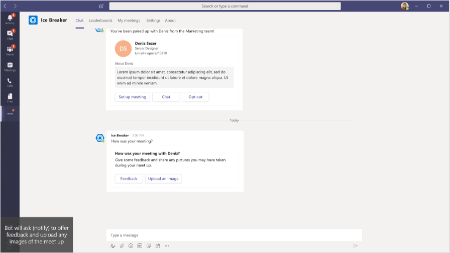
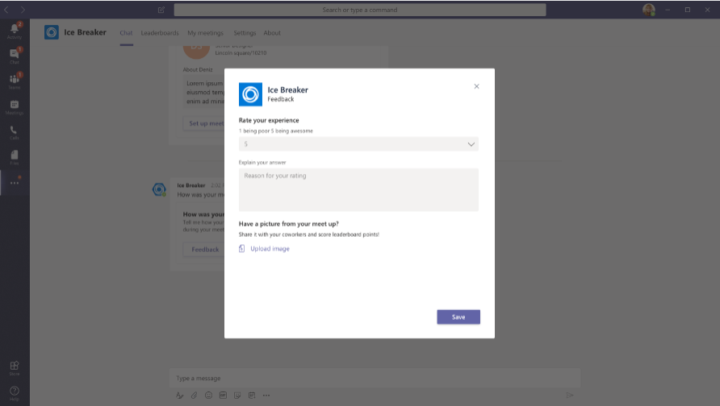
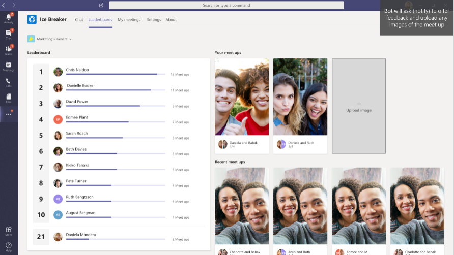
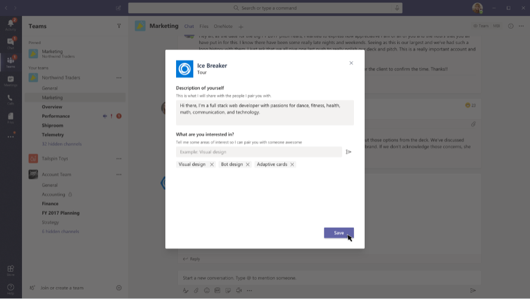
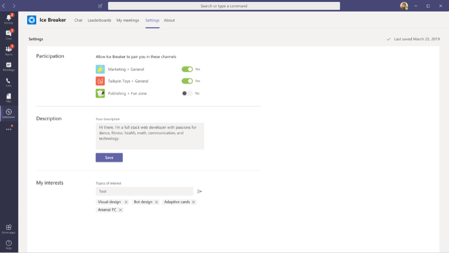

Want to take a stab at extending Icebreaker? Here are some ideas:

# Change the pair up schedule

Here's a cool video another community member produced outlining how to trigger custom pair ups. 

[How to: Adjust the Pairing Schedule of the Icebreaker Bot (Teams App Template)](https://blog.thoughtstuff.co.uk/2019/07/how-to-adjust-the-pairing-schedule-of-the-icebreaker-bot-teams-app-template/)

# Post-meeting follow-up

After a few days, ask the users that you've matched how their meetups went.

# Leaderboard

Add a "gamification" aspect to Icebreaker by creating a leaderboard tab, ranking team members by the number of meetups they've completed.

# Personalized introductions and interests

Let users set a intro description and/or their interests, and include that in the pair-up notification. That gives the paired team members more context about each other, and maybe something to talk about :)

You can even refine the pairing algorithm to take into account shared interests when matching users. (The current version of Icebreaker simply pairs members randomly.)

# Settings tab

Add a settings tab so users can control their Icebreaker experience:
* which teams they want to participate in
* their introduction and interests
* how often they want to get paired up

