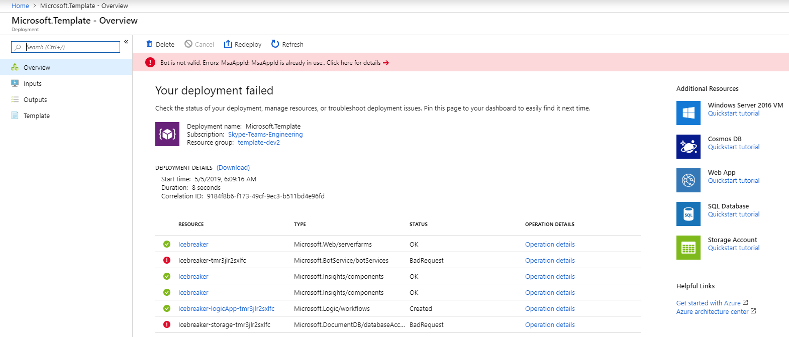
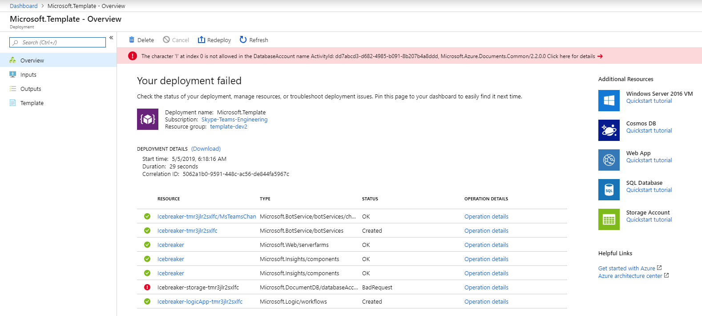
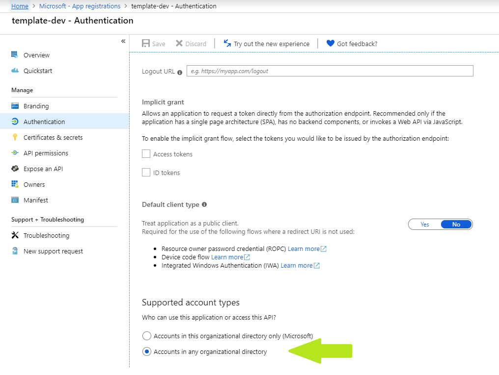

## General Template Issues

### Generic possible issues
There are certain issues that can arise that are common to many of the app templates. Please check [here](https://github.com/OfficeDev/microsoft-teams-stickers-app/wiki/Troubleshooting) for reference to these.

## Problems deploying to Azure

### 1. Error when attempting to reuse a Microsoft Azure AD application ID for the bot registration

```
Bot is not valid. Errors: MsaAppId is already in use.
```
* Creating the resource of type Microsoft.BotService/botServices failed with status "BadRequest"

This happens when the Microsoft Azure AD application ID entered during the setup of the deployment has already been used and registered for a bot.

#### Fix
Either register a new multi-tenant Microsoft Azure AD application or delete the bot registration that is currently using the attempted Microsoft Azure AD application ID.

### 2. Error when attempting to use capital letter in the Cosmos database creation

```
The character 'I' at index 0 is not allowed in the DatabaseAccount name ActivityId: XXXXXXXX-XXXX-XXXX-XXXX-XXXXXXXXXXXX, Microsoft.Azure.Documents.Common/2.2.0.0
```
* Creating the resource of type Microsoft.DocumentDB/databaseAccounts failed with status "BadRequest"

This happens when the name used for creating the Azure Cosmos DB Account starts with a capital letter.

#### Fix
Rename the Cosmos DB name to have all lowercase characters and redeploy.

## Problems running the Teams Bot

### 1. Generic error reported by Bot Framework for an authentication failure when trying to send the welcome message
This can be due to a couple of issues, but an easy "gotcha" is that, when creating the Microsoft Azure AD application, the default setting for "Supported account types" was used rather than changing it to "Accounts in any organizational directory", thus making the app a single tenant app and not accessible to Bot Framework.


#### Fix
Change the "Supported account types" setting for the app by navigating to App registrations, finding your app, navigating to the Authentication section under Manage, and changing the "Supported account types" setting to "Accounts in any organizational directory."


## Didn't find your problem here?

Please, report the issue [here](https://github.com/OfficeDev/microsoft-teams-icebreaker-app/issues/new). Thank you!
